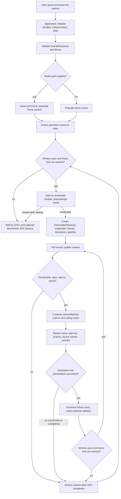
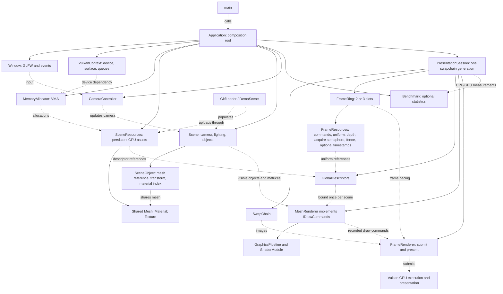

# Application flow and architecture

These diagrams describe the current implementation. Solid architecture arrows show ownership;
dotted arrows show borrowed dependencies or data flow. Asset loading completes before the resource
table is frozen. Scene state and uploaded assets survive presentation-session recreation.

## Application flow



Minimization pauses at `Window::WaitUntilRenderable`. Resize and out-of-date/suboptimal swapchains
retire the current presentation session and create a new one once the window is renderable.
A close request or frame limit exits the loop. Unexpected Vulkan/import errors unwind RAII owners
and are reported by `main`.

## Component architecture



`Application` declares dependencies before their consumers so reverse destruction keeps the device
and allocator alive until their resources are released. `PresentationSession` owns size-dependent
rendering state; `SceneResources` owns assets independently of that session. `SceneObject` shares
immutable mesh ownership and stores its own node/local transforms and material index.

`MeshRenderer` implements `IDrawCommands`, allowing frame scheduling to consume other draw
implementations without depending on scene-mesh details. It performs optional CPU frustum culling,
binds the pipeline and descriptor table, then pushes each visible object's mesh address, model
matrix, frame index, and material index. The GPU uses buffer-device-address vertex pulling,
dynamic rendering, depth testing, and textured Lambert/unlit material shading.

## One frame: CPU/GPU handoff

```mermaid
sequenceDiagram
    participant App as Application
    participant Session as PresentationSession
    participant Renderer as FrameRenderer
    participant Slot as FrameResources
    participant Draw as IDrawCommands / MeshRenderer
    participant GPU as Graphics queue
    participant Present as Present queue
    App->>Session: DrawFrame()
    Session->>Session: Build uniform; set matching culling matrix
    Session->>Renderer: DrawFrame(uniform)
    Renderer->>Slot: Wait for this slot's previous fence
    Renderer->>Slot: Read completed GPU timestamps if enabled
    Renderer->>Renderer: Acquire swapchain image; signal acquire semaphore
    Renderer->>Slot: Reset command pool and upload uniform
    Renderer->>Renderer: Begin commands; Synchronization2 attachment transitions
    Renderer->>Renderer: Start timestamp; begin dynamic rendering
    Renderer->>Draw: Record(commandBuffer, frameIndex)
    Draw->>Draw: Cull; bind pipeline/table; push object data; draw indexed
    Renderer->>Renderer: End rendering; end timestamp; transition to present
    Renderer->>GPU: vkQueueSubmit2: wait acquire; signal image's present semaphore and slot fence
    Renderer->>Present: vkQueuePresentKHR: wait present semaphore
    Renderer->>Renderer: Advance slot modulo 2 or 3
    Renderer-->>Session: Success or recreate required
    Session-->>App: Frame result and optional statistics
    Note over Slot,GPU: GPU execution is asynchronous; the next frame may use another slot.
    Note over Renderer,Present: Present semaphores belong to swapchain images, not frame slots.
```

The slot fence protects command-pool reuse and uniform updates. The acquired-image semaphore
synchronizes attachment access with image availability. A separate semaphore per swapchain image
protects presentation reuse. There is no device-idle wait in the normal frame loop; session retirement
and final teardown wait before destroying GPU resources. GPU timestamp results are consumed only
when the corresponding slot's fence has completed.

## Files created or changed for these diagrams

- Created: Docs/ARCHITECTURE.md.
- Changed: VulkanProj.vcxproj and VulkanProj.vcxproj.filters to expose this document under Docs.
